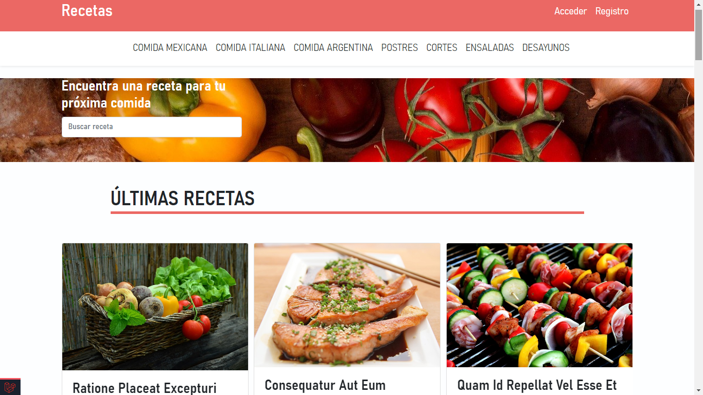
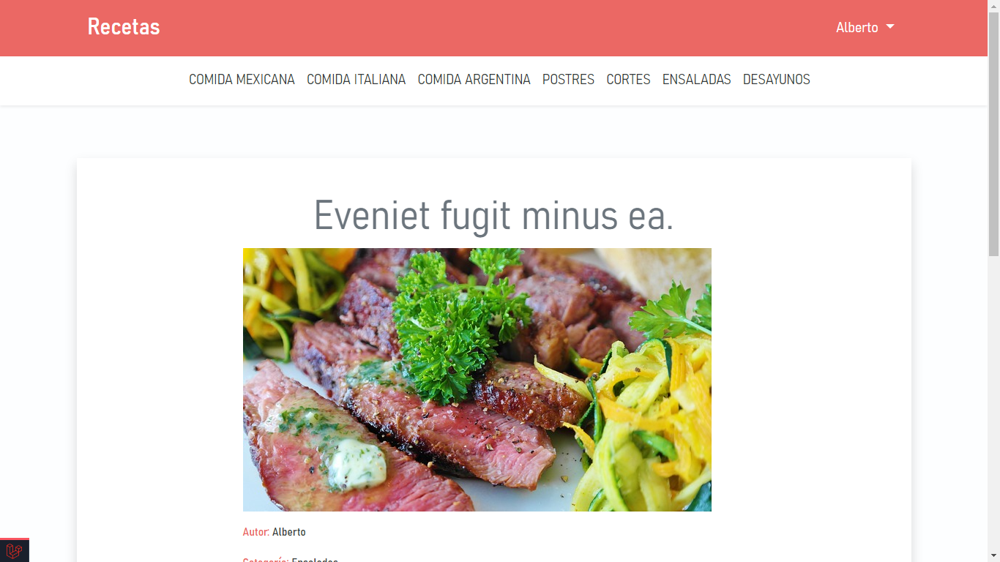
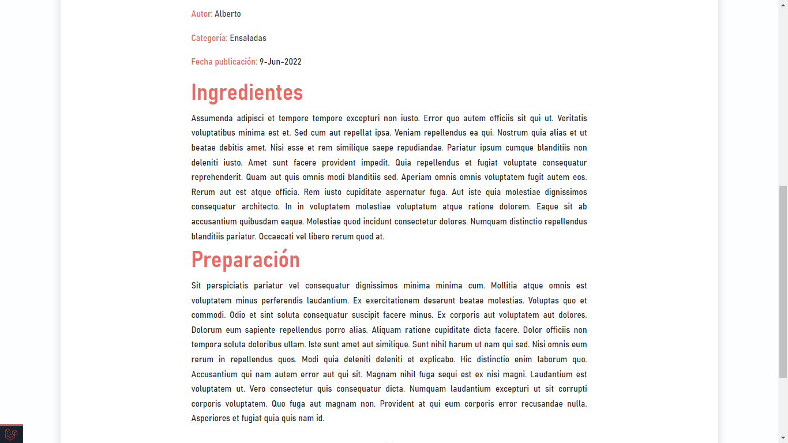

# Descripción General - Recetas
Es un blog de recetas de cocina. Donde los usuarios pueden crear, editar y eliminar sus recetas en un panel de administración. También los usuarios tienen un perfil que pueden subir una foto y editar el mismo. Cada receta tiene una categoría, y el usuario interesado en una receta puede verla y darle me gusta. Al darle me gusta, automáticamente se creara una sección en específica para el usuario de las recetas que le han gustado. Al inicio los usuarios pueden realizar búsquedas y ver las recetas por categoría. Se implementó el paquete de autenticación laravel UI.  

# Requerimientos
* PHP 7.4
* Laravel 7
* phpMyAdmin
* Instalado:
    * Composer
    * Node.js
    * npm

Notas: 
* Si usas un SGBD diferente, debes mirar la documentación oficial de Laravel y ajustar los nuevos parámetros de las credenciales en el archivo .env
[Leer más](https://laravel.com/docs/7.x/database "Ir a  documentación")

# Primeros pasos

### **Descarga o clona este repositorio**
```bash
git clone https://github.com/olmos-dev/recetas.git
```

### **Instalar**
Instala la carpeta *vendor* para el proyecto
```bash
composer update
```

Instala *node modules*
```bash
npm install
```

### **Configurar la Base de Datos**

1. crea una nueva base de datos llamada receta

2. crea un nuevo archivo .env en la raíz del proyecto

3. Ahora ajusta los parámetros de las base de datos que utilizas en el archivo .env

    ```bash
    DB_CONNECTION=mysql
    DB_HOST=127.0.0.1
    DB_PORT=3306
    DB_DATABASE=receta
    DB_USERNAME=root
    DB_PASSWORD=
    ```
4. También ajusta la configuración y las credenciales de **mailtrap** (debes de crear una cuenta o usar algún otro servicio) en el archivo .env

    ```bash
    MAIL_MAILER=smtp
    MAIL_HOST=sandbox.smtp.mailtrap.io
    MAIL_PORT=2525
    MAIL_USERNAME="tu_username"
    MAIL_PASSWORD="tu_contraseña"
    MAIL_ENCRYPTION=tls
    MAIL_FROM_ADDRESS="receta@example.com"
    MAIL_FROM_NAME="${APP_NAME}"
    ```

5. Debes ejecutar las migraciones para crear la tablas en la base de datos 
    ```bash
    php artisan migrate
    ```
6. Debes ejecutar los *seeders* para poblar la base de datos 
    ```bash
    php artisan db:seed
    ```

### **Genera una llave**

Debes generar una nueva llave para la aplicación

```bash
php artisan key:generate
```

# Ejecutar el proyecto
Ejecuta el servidor de laravel
```bash
php artisan serve
```
Ejecuta el servidor de npm 
```bash
npm run watch
```
Ahora abre el proyecto y disfruta de la aplicación
```bash
http://127.0.0.1:8000/
```
Nota: hay tres perfiles para iniciar sesión disponibles o también puedes registar un nuevo usuario

|Correo|Contraseña|
|:-----|-------:|
|alberto@mail.com|123
|carlos@mail.com|123

# Tecnologías y herramientas usadas
* Laravel 7
* Vue 3 (en la sección de dar likes)
* PHP 7.4
* Bootstrap 4.6
* phpMyAdmin 
* Javascript

# Documentación

## Diagrama entidad relación


## Relaciones
* Tabla **users** tiene una relacion muchos a muchos con la tabla **receta**. La tabla terciaria es **likes_receta**
* La tabla **users** tiene una relacion de uno a muchos con la tabla **receta**
* La tabla **categoria** tiene una relacion de uno a muchos con la tabla **receta**
* La tabla **users** tiene una relacion uno a uno con **perfil** 


## Laravel UI
Se utilizó el paquete de autenticación **Laravel UI**
* Inicio de sesión con correo electrónico
* Registro de usuarios
* Restablecimiento de contraseñas 
* Configuración de servidor SMTP (mailtrap) para envio de enlaces al correo para restablecer contraseñas y verificación del correo electrónico

## Screenshots







